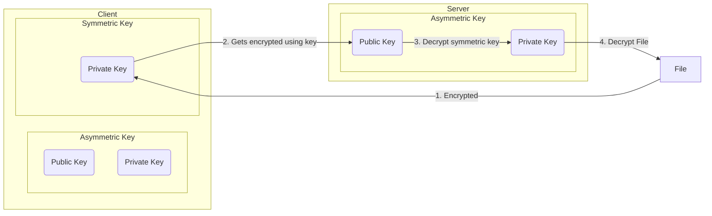

## Symmetric Encryption

<iframe id="wiki" src="https://en.wikipedia.org/wiki/symmetric encryption?printable=yes" width="100%" height="800"></iframe>

```python
"""
Fernet is built on top of a number of standard cryptographic primitives. Specifically it uses:
   AES in CBC mode with a 128-bit key for encryption; using PKCS7 padding.
   HMAC using SHA256 for authentication.
   Initialization vectors are generated using os.urandom().
"""

from cryptography.fernet import Fernet

key = Fernet.generate_key()  # Generates a 128-bit key for encryption
print("Key:", key)

f = Fernet(key)

data = bytes("Hey dont look at me!", "utf-8")

encrypted_data = f.encrypt(data)  # Encrypt the string
print("Encrypted text:", encrypted_data)

decrypted_data = f.decrypt(encrypted_data)  # Decrypt using key stored in Fernet(key)
print("Decrypted text:", decrypted_data.decode())

"""
Key: b'TMz6kOOm3spmspIMWXzSmKrNyBxSArCniuL8bNfsjTQ='
Encrypted text: b'gAAAAABmQuWOyH204b-4RP2t8ieJvo8f2I9-cHFZ6gi-hYvDBb52qtHMEyG8g-7d5nOYE--WG3xEALBwvTkiwPZ80oP2-RBmraP3xsFRGmNA-5t2QGALBzM='
Decrypted text: Hey dont look at me!
"""
```

## Asymmetric (Public-key cryptography)

<iframe id="wiki" src="https://en.wikipedia.org/wiki/asymmetric encryption?printable=yes" width="100%" height="800"></iframe>

```python
import rsa

# Generate public and private RSA keys
public_key, private_key = rsa.newkeys(1024)

data = bytes("super secret terraform spn creds", "utf-8")
# Encrypt the message using the public key, ready for transportation
print("Public Key:", public_key)
print("Private Key:", private_key)

e_data = rsa.encrypt(data, public_key)
print("Encrypted text:", e_data)

# Decrypt the encrypted data using the private key
d_data = rsa.decrypt(e_data, private_key)
print("Decrypted text:", d_data.decode())

"""
Public Key: PublicKey(101987508639932692338508891363538110830817381389781440997155394194836861820691807857488533797587598881303863752019949392134001482679823178342082336376656311835479552411263788659885409175362320650059617243587340509704301437680095781514016186660016071937352756889883838683422329671123232296549810337014799352867, 65537)
Private Key: PrivateKey(101987508639932692338508891363538110830817381389781440997155394194836861820691807857488533797587598881303863752019949392134001482679823178342082336376656311835479552411263788659885409175362320650059617243587340509704301437680095781514016186660016071937352756889883838683422329671123232296549810337014799352867, 65537, 17626875053245000627405743510914387008570250072509489024135666112957827392815907160867488934880674009010617890949081690719774093936468821293021745318710431651208802993166297754242748455507371482485461736885364834337681692945837554181406044355231862066341207341638183260787079826630745986081401769048917427249, 44247025733648380466345103999395363455400590304138902492512990952980308582800388029990151854076770496807828574439995344803245172852441019163757734771341041537154443, 2304957382985736131798203939805264151670628509437404137008388441196289609101245674420439509869331288252674746091461771835847915698681842521364169)
Encrypted text: b'6\xa3\x1e\xed\x89E\xce\x08|-\xc3\x03\xdefFd\xe0t\x86\xb1\xbe\x0ev\xc8\x15\xcaw\xee\xc2\xc6\x1e\x93Y"+@\x8d\xbe\xe0\xe0\x8a\\\xe9\x14H\xc4\xee\x07\x88\xdeV`\xdaW2y\xfdt\x14G\n;\x83\xa0\x87nO~^\xa5\x1by~\x8a\xcd\x9d\xd92\x0f\xb8\xac\xec\x03``\x8b\x98\xf0\xe7\x9bgz\x89s\xc7$}\xa4\xa4[O\x99k\x8d)\xcc\x1c\xbbm\x92\x83\xee\xf0\xcbw\x17Y\xf2US\xea|\xb3@2fua'
Decrypted text: super secret terraform spn creds
"""
```

### Notes

- We Encrypt with a public key provided, and decrypt with a private key
- With RSA you can only encrypt data less than the size of the key therefor it does not make sense to encrypt large files
  - Common approach is to encrypt files with symmetric key then use asymmetric encryption to send the symmetric key

## Public Key Encryption with Symmetric Encryption


